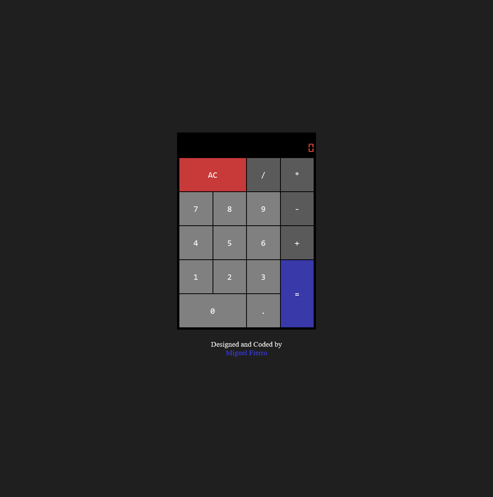

# Javascript Calculator

## Table of contents

- [Overview](#overview)
  - [The challenge](#the-challenge)
  - [Screenshot](#screenshot)
  - [Links](#links)
- [My process](#my-process)
  - [Built with](#built-with)
  - [What I learned](#what-i-learned)
  - [Continued development](#continued-development)
- [Author](#author)

## Overview

### The challenge

Users should be able to:

- Enter a number of any length
- Compute two numbers using the provided operators
- The calculator will use order of operations to calculate a string of numbers and operations

### Screenshot

### Links

- Live Site URL: [Live Site](https://www.miguelfierro.dev/Javascript-Calculator/)

## My process

### Built with

- Semantic HTML5 markup
- CSS custom properties
- Javascript
- Flexbox
- Mobile-first workflow
- [React](https://reactjs.org/) - JS library

### What I learned

This was one of my first projects in React and I learned a lot using the React framework. Coming from using only HTML and CSS React is a real breath of fresh air and makes developing apps such as this very simple and easy.

### Continued development

For future projects I would very much like to continue working with React and further improve my skills in web development.

## Author

- Website - [Miguel Fierro](https://www.miguelfierro.dev/)
